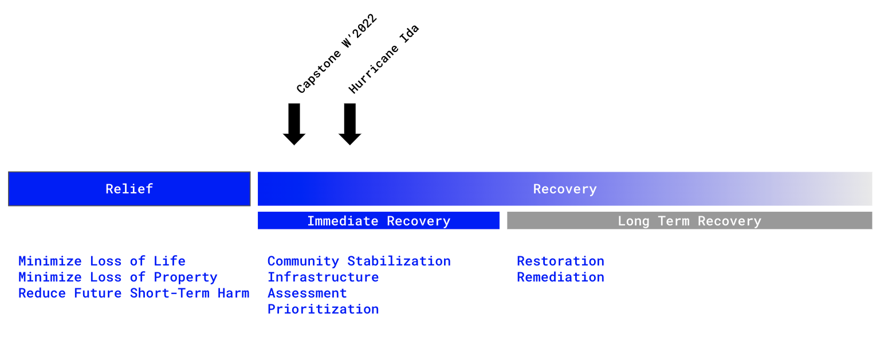

# After the Deluge* Capstone
_*of Water, of Data._  

University of Michigan  
Taubman College of Architecture and Urban Planning 
URP603 Capstone / Winter 2022 

In Collaboration with the National Disaster Preparedness Training Center (NDPTC) at the University of Hawaii

## About the Course
This capstone at the University of Michigan will be in collaboration with the *National Disaster Preparedness Training Center (NDPTC)*. This organization works directly with responders, recovery experts, and all levels of government in addressing natural hazards, coastal communities, and the special needs and opportunities of islands and territories. Through this collaboration, we will be using the recovery planning after Hurricane Ida as a case study for our work, focusing on the low parishes of Louisiana in the wake of Hurricane Ida in 2021. 

After relief efforts have been completed, the planning and prioritization of efforts for recovery are often difficult and drawn out. This is particularly challenging for early-stage relief efforts, where communities shape plans that address the most significant need areas, including housing, infrastructure, and social and human welfare. (This stage is distinct from long-term recovery efforts with a focus on adaptation and resilience.) Many researchers and responders have pointed to the emergence of digital data and emerging computational tools to assist in the discovery and prioritization of needs in these communities. Still, there lacks a comprehensive investigation of how these may or may not be opportunities to shape policy decisions. We will consider these emerging technologies in relation to FEMA’s Recovery Framework and 32 Core Capabilities. 

This capstone will investigate these technological issues within the context of damage assessment and early recovery and how we can identify areas of prioritization after a natural disaster. We will propose, test, and validate new approaches to analyzing digital data, including satellite imagery, social media, and crowdsourced sources, to aid in prioritization. This involves analysis and exploration of mixed data sources, analytical approaches, and their opportunities and limitations. We will employ a “Whole of Society” perspective to consider how various communities can utilize these approaches, including policymakers and responders. We will propose facilitating technology transfer, documentation and packaging, and capacity building through education and training. Additionally, we will consider ways to complement and/or embed themselves in local and indigenous values for recovery. 
The following are potential outcomes of the student-led investigation. 

We note that students can shape these deliverables beyond a traditional report, with an effort to make them relevant and open to a variety of constituents... Including you here at our Github. 

